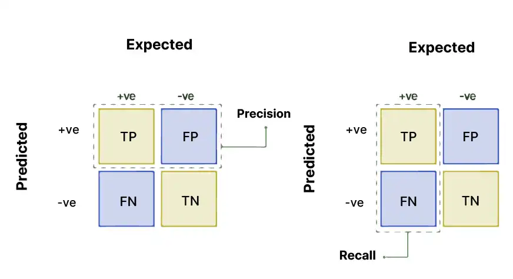
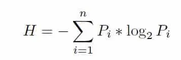
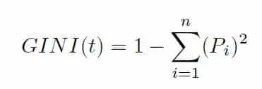
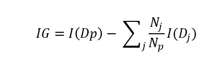
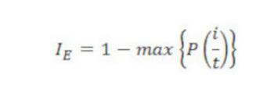
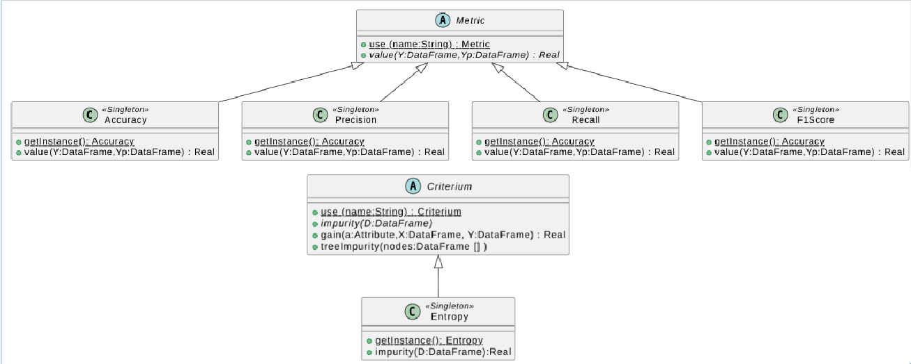
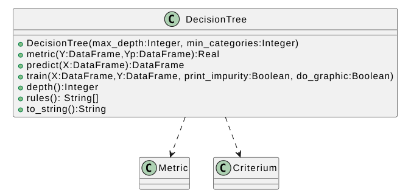

# ESCUELA COLOMBIANA DE INGENIERÍA

# PRINCIPIOS Y TECNOLOGÍAS IA 2025-2

## ARBOLES DE DECISIÓN

## LABORATORIO 2/4

**OBJETIVOS**

Desarrollar competencias básicas para:

1.  Modelar y resolver problemas usando árboles de decisión
2.  Implementar árboles de decisión
3.  Apropiar un framework para árboles de decisión (*scikit-learn*)
4.  Conocer una librería para procesamiento de datos simbólicos (*python
    pandas DataFrame*)

**ENTREGABLE**

*Reglas para el envío de los entregables*:

-   **Forma de envío:** Este laboratorio se debe enviar únicamente a
    través de la plataforma Moodle en la actividad definida. Se tendrán
    dos entregas: inicial y final.

-   **Formato de los archivos:** Incluyan en un archivo *.zip* los
    archivos correspondientes al laboratorio.

-   **Nomenclatura para nombrar los archivos:** El archivo deberá ser
    renombrado, "DT-lab-" seguido por los usuarios institucionales de
    los autores ordenados alfabéticamente (por ejemplo, se debe
    adicionar pedroperez al nombre del archivo, si el correo electrónico
    de Pedro Pérez es <pedro.perez@mail.escuelaing.edu.co>)

# **PARTE I. IMPLEMENTACIÓN DE ÁRBOLES DE DECISIÓN** 

Para este apartado se van a implementar un árbol de decisión, en este
caso usando como medida la entropia.

*La idea de los árboles de decisión fue desarrollada paulatinamiente. El
pionero más reconocido es Ross Quinlan, quien propuso en 1986 el
algoritmo ID3 (Iterative Dichotomiser 3) en el artículo [Induction of
decision trees](https://link.springer.com/article/10.1007/BF00116251).
Este algoritmo marcó un hito en la construcción automática de árboles de
decisión a partir de datos.*

## I.A. IMPLEMENTACIÓN DE UN ÁRBOL DE DECISIÓN 

Implementar un árbol de decisión; calculando una salida $\check{Y} (Yp)$
para unas entradas $X$.

**Propiedades:**

-   Tarea: **Clasificación binaria**
-   Características: **Categóricas**
-   Criterio de selección: **Ganancia de información**
-   Métrica para evaluación: **F1 SCORE**



> **Formulas**

-   Impureza : **Entropía: H**

-   Ganancia de información: **IG(D,A)**

-   Impureza de Arbol: **Impurity(V\*)**

## Paso 1. Criterios de selección de atributos 

Las impurezas en árboles de decision miden cuán homogéneas o
heterogéneas son las clases dentro de un conjunto de datos ***en un nodo
del árbol***. La métrica de impureza determina cómo dividir los datos en
cada nodo. Los principales métodos de evaluación de impureza son:
**entropía** e **índice gini**.

*Incluyan las fórmulas de los dos criterios de selección y comparelos
considerando criterios como sensibilidad al desbalance de clases y
eficiencia computacional*

------------------------------------------------------------------------

**Entropia:**



Donde i = Clase única en S.

p_i = Proporción de ejemplos que pertenecen a la clase i en S.


------------------------------------------------------------------------

**Gini:**



Donde Pi es la probabilidad de que un ejemplo sea de la clase i.

------------------------------------------------------------------------

**Comparación:**

Ambos criterios de selección se encargan de medir qué tan impuro puede ser un dataset
y determinar cómo dividir los datos en cada nodo.

En ambos casos, la impureza se mide en un rango de 0 a 1, siendo que entre más cercano a 0
el dataset es más puro, mientras que si se acerca más a 1, el conjunto es más impuro.

La entropía se encarga de medir el grado de incertidumbre en cada uno de los subconjuntos del dataset y se elige la división 
que produzca el nodo más puro (el de menor valor de entropía). Como esta medida depende directamente de las proporciones 
de cada clase, los cambios en la entropía tienden a ser más variables y sensibles ante pequeños cambios o desbalances en las clases.

El índice Gini, por su parte, mide la probabilidad de clasificar incorrectamente un elemento si se asigna una clase de forma aleatoria.
Al ser una medida más sencilla, basada únicamente en operaciones cuadráticas (p_i^2), es más eficiente computacionalmente que la entropía.
Además, suele ser menos sensible al desbalance de clases, lo que lo hace práctico en conjuntos de datos grandes o con clases desiguales.

---

(Guerard_Guillaume, 2024)

## Paso 2. Ganancia de una característica e impureza del árbol 

Los otros dos conceptos se fundamentan los árboles de decisión son la
**ganancia de información** y la **impureza *de un arbol***.

*Expliquen su proposito y la fórmula correspondiente, detallandola.*

------------------------------------------------------------------------

**Ganancia:**

Es una métrica usada en árboles de decisión que busca medir la reducción de la impureza de una característica de un 
conjunto de datos al dividirlo en función de esa característica.
Su propósito es ayudar a decidir cuál atributo es el mejor para dividir los datos en un nodo del árbol de decisión.
Entre más alta sea la ganancia, mejor separa las clases y más puro se vuelve el subconjunto.



I es la función que mide la impureza

Dp es el dataset "padre" que se está dividiendo

Np es el número de elementos del dataset padre

Dj es el dataset j-ésimo en el que se ha dividido Dp

Nj es el número de elementos del dataset Dj

------------------------------------------------------------------------

**Impureza:**

Las impurezas en árboles de decisiones se encargan de medir que tan homogéneas o heterogéneas son las clases en un conjunto
datos en un nodo del árbol. Ell nodo es puro si tiene ejemplos de solo una clase, es más impuro si hay mezclas entre las clases.

Formulas de impureza:

Entropy:


Gini:


Error de clasificación: Se encarga de medir la proporción de ejemplos que no pertenecen a la clase más común.




---

## Paso 3. Implementación del código base para un árbol de decisión 

### Librería necesaria

``` python
import pandas as pd
from abc import ABC, abstractmethod
```

### Funciones base: métrica y criterio



### Métrica

``` python
class Metric(ABC):
  """ Abstracta: define entradas, salidas y el comportamiento inicial de los métodos clave para cualquier metrica
  Representa una metrica de desempeño P para evaluar una tarea T
  """
  @classmethod
  def use(cls,name: str):
    """ obtiene metrica (OBJ) a partir del nombre
    Args:
      name  : nombre esperado de la metrica
    Returns:
       objeto metrica
    """
    pass

  def value(self, Y: pd.DataFrame, Yp: pd.DataFrame)->float:
    """ computa el desempeño P
    Args:
      Y   s de salidas esperadas (etiquetadas)
      Yp  : valores de salidas obtenidas
    Return:
      valor del desempeño
    """
    pass
```

``` python
# Documentar los métodos implementados
class Accuracy(Metric):
  """ Metrica de exactitud (acertados / totales). Implementa Metric
  """
  def __new__(cls):
    pass

  def value(self, Y: pd.DataFrame, Yp: pd.DataFrame)->float:
    pass
```

``` python
# Documentar los métodos implementados
class Precision(Metric):
  """ Metrica de precision). Implementa Metric
  """
  def __new__(cls):
    pass

  def value(self, Y: pd.DataFrame, Yp: pd.DataFrame)->float:
    pass
```

``` python
# Documentar los métodos implementados
class Recall(Metric):
  """ Metrica de exhaustividad. Implementa Metric
  """
  def __new__(cls):
    pass

  def value(self, Y: pd.DataFrame, Yp: pd.DataFrame)->float:
    pass
```

``` python
# Documentar los métodos implementados
class F1Score(Metric):
  """ Metrica de media armónica entre Precisión y Exhaustividad. Implementa Metric
  """
  def __new__(cls):
    pass

  def value(self, Y: pd.DataFrame, Yp: pd.DataFrame)->float:
    pass
```

``` python
# Adicione los casos de prueba de los métodos implementados
```

### Criterio

``` python
class Criterium(ABC):
  """ Abstracta: Define el criterio para seleccionar y dar prioridad a los atributos
  Representa la impureza
  """
  @classmethod
  def use(cls, name: str):
    """ obtiene criterio de selección (OBJ) a partir del nombre
    Args:
      name  : nombre esperado del criterio
    Returns:
      objeto criterio de selección
    """
    pass

  def impurity(self, V: pd.DataFrame) -> float:
    """ computa la impureza en un nodo/vértice
    Args:
      V    : ejemplares para una característica
    Returns:
       valor de la impureza del nodo
    """
    pass

  def gain(self, a: str, X: pd.DataFrame, Y: [pd.DataFrame]) -> float:
    """ computa la ganancia de información de un nodo con 1 o más hijos
    Args:
      a  : atributo/característica a evaluar
      X : ejemplares / valores de entrada
      Y : valores de salida esperados
    Returns:
      valor de la ganancia de información
    """
    pass

  def treeImpurity(self, nodes: [pd.DataFrame]) -> float:
    """ computa la impureza de todo un arbol
    Args:
      nodes    : datos de cada uno de los nodos del arbol
    Returns:
      valor de la impureza del arbol
    """
    pass
```

``` python
# Documentar los métodos implementados
class Entropy(Criterium):
  """ Criterio de selección - impureza por entropia
  """
  def __new__(cls):
    pass

  def impurity(self, V: pd.DataFrame) -> float:
    pass

  def gain(self, a: str, X: pd.DataFrame, Y: pd.DataFrame) -> float:
    pass

  def treeImpurity(self, nodes: pd.DataFrame) -> float:
    pass
```

``` python
# Adicione los casos de prueba de los métodos implementados
```

### Árbol de decisión

Para la implementación sigan las decisiones de diseño presentadas en el
diagrama de clases. Pueden incluir los métodos y clases adicionales que
requieran.

#### Nomenclatura

-   **Datos**
    -   *c*: número de características
    -   *m*: número de ejemplares
    -   **x**, **X**: entradas. Un ejemplo (1xc) o todos los ejemplos
        (mxc)
    -   **y**, **Y**: salidas reales. Un ejemplo (1xc) o todos los
        ejemplos(mxc)
    -   **yp**, **Yp**: salidas estimadas. Un ejemplo (1xc) o todos los
        ejemplos(cxm)



``` python
class DecisionTree:
  """ Representa un árbol de decisión
  """
  def __init__(self, max_depth: int, min_categories: int):
    """ inicializar la clase de árbol de decisión.
    Args:
      max_depth   : Profundidad máxima del árbol de decisión
      min_categories   : Número mínimo de categorias para dividir un nodo
    """
    pass

  def metric(self, Y: pd.DataFrame, Yp: pd.DataFrame) -> float:
    """ computa la metrica del modelo a partir de los ejemplares comparando las salidas
    Args:
      Y  : valores de salidas esperadas (etiquetadas)
      Yp  : valores de salidas obtenidas
    Return:
       desempeño del modelo para ejemplares
    """
    pass

  def predict(self, X: pd.DataFrame) -> pd.DataFrame:
    """ computa una serie de entradas a traves del arbol generando una predicción
    Args:
      X    : valores de características (entradas)
    Return:
     valores de salidas obtenidas
    """
    pass

  def train(self, X: pd.DataFrame, Y: pd.DataFrame, print_impurity: bool, do_graphic: bool):
    """ construye y entrena el árbol de decisión a partir de unos ejemplares.
    Args:
      X  : valores de características - conjunto de entrenamiento
      Y  : valores de salidas esperadas - conjunto de entrenamiento
      print_impurity : mostrar la impureza del arbol por iteración
      do_graphic: graficar las impurezas por iteración
    """
    pass

  def depth()->int:
    """ consulta la profundidad del árbol
    Return:
      profundidad del árbol
    """
    pass

  def rules() -> [str]:
    """ consultar las reglas del árbol
    Return:
      reglas del árbol de decisión
    """
    pass

  def to_string() -> str:
    """ consultar la estructura del arbol
    Return:
      estructura del árbol
    """
    pass
```

``` python
# Como primer caso de prueba entrene un árbol para calcular el operador lógico and. Explique los resultados.
```

``` python
# Como segundo caso de prueba entrene un árbol para calcular el operador lógico or. Explique los resultados.
```

``` python
# Como tercer caso de prueba entrene un árbol para calcular el operador lógico xor. Explique los resultados.
```

``` python
# Como último caso de prueba entrene un árbol para el dataset propuesto por su profesor. Use 80% para entrenamiento y 20% para pruebas. Explique los resultado.
```


# **PARTE II. USO DE FRAMEWORK PARA ÁRBOLES DE DECISIÓN**

Para este apartado se va a hacer uso de una librería que brinda de
manera simplificada un entrenamiento flexible de distintos algoritmos
basados en árboles de decision. En este caso será **scikit-learn**

**Scikit-learn** es una biblioteca de Python que facilita la
implementación de algoritmos de aprendizaje automático. Es ampliamente
usada en la industria por su simplicidad, buena documentación y
eficiencia.

**Scikit-learn** ofrece diferentes estrategias de aprendizaje basadas en
árboles; entre ellas las que exploraremos en este laboratorio.

-   [DecisionTreeClassifier](https://scikit-learn.org/stable/modules/generated/sklearn.tree.DecisionTreeClassifier.html)
-   [RandomForestClassifier](https://scikit-learn.org/stable/search.html?q=RandomForestClassifier)
-   [GradientBoostingClassifier](https://scikit-learn.org/stable/modules/generated/sklearn.ensemble.GradientBoostingClassifier.html)

------------------------------------------------------------------------

Resuelvan un problema de clasificación usando el *dataset* definido por
su profesor. (70% entrenamiento, 10% validación y 20% pruebas)

## Paso 1: Definir el problema Antes de desarrollar un modelo, es
Fundamental establecer qué se quiere lograr y cómo se medirá el éxito.
Esto implica explicar el problema, elegir una métrica adecuada
(f1_score) y establecer un umbral de desempeño.

Lo que vamos hacer es construir un modelo de clasificacion basado en arboles de decision que permite predecir si las personas
tienen un sueldo anual que sea superior a $50.000, para esto vamos a utilizar la informacion de las variables demograficas y
laborales ubicadas en el dataset de Adult Census Income.

Este es un preoblema de clasificacion binaria supervisada, debido que solo hay dos posibles resultados. El objetivo del modelo
es que que aprenda patrones a base del conjunto de entrenamiento y pueda generalizar correctamente con informacion nueva.

La metrica que vamos a utilizar es la F1-score ua que esta balance la precision y exhaustividad. Este al ser un problema de clasificacion
binaria que puede tener clases desbalanceadas el F1-score puede alcanzar una evaluacion mas representativa que accuracy.

## Paso 2: Explorar y preparar los datos Para comprender la naturaleza de
Los datos que estamos utilizando es necesario **explorar** el *dataset*
con visualizaciones adecuadas que permitan conocer la distribución de
clases o valores, la presencia de valores nulos o atípicos y las
correlaciones entre variables.

**Preparar** los datos para que la red pueda aprender de manera
eficiente implica, cuando se requiera, la limpieza de datos, la
normalización o estandarización de valores, la codificación de variables
categóricas y la separación en conjuntos de entrenamiento (train),
validación (dev) y prueba (test).

``` python
#Analizar los datos
import pandas as pd
import seaborn as sns
import matplotlib.pyplot as plt
import os

# Obtener ruta absoluta a la carpeta resources
base_path = os.path.join(os.path.dirname(__file__), '../../resources')

train_path = os.path.join(base_path, 'adult.data')
test_path = os.path.join(base_path, 'adult.test')

# Definir nombres de columnas
columns = [
    'age', 'workclass', 'fnlwgt', 'education', 'education-num',
    'marital-status', 'occupation', 'relationship', 'race', 'sex',
    'capital-gain', 'capital-loss', 'hours-per-week', 'native-country', 'income'
]

# Cargar archivos
train_data = pd.read_csv(train_path, names=columns, na_values='?', skipinitialspace=True)
test_data = pd.read_csv(test_path, names=columns, na_values='?', skipinitialspace=True, skiprows=1)

# Unir para análisis conjunto
data = pd.concat([train_data, test_data], axis=0)

# Normalizar la columna 'income'
data['income'] = data['income'].str.replace('.', '', regex=False).str.strip()

print("Dimensiones del dataset:", data.shape)
print("\nPrimeras filas del dataset:")
print(data.head())

print("\nValores nulos por columna:")
print(data.isnull().sum())

print("\nDistribución de la variable objetivo (income):")
print(data['income'].value_counts())

# Distribución de algunas variables numéricas
data[['age', 'hours-per-week', 'education-num']].hist(bins=20, figsize=(10, 5))
plt.suptitle('Distribución de variables numéricas')
plt.show()

# Seleccionar solo columnas numéricas
numeric_data = data.select_dtypes(include=['int64', 'float64'])

# Calcular matriz de correlación
corr_matrix = numeric_data.corr()

# Mostrar la matriz completa
print("\nMatriz de correlación:")
print(corr_matrix)

# Visualización con mapa de calor
plt.figure(figsize=(12, 8))
sns.heatmap(corr_matrix, annot=True, fmt=".2f", cmap="coolwarm")
plt.title("Matriz de correlación entre variables numéricas")
plt.show()
```

*Incluyan observaciones*

``` python
import pandas as pd
import numpy as np
from sklearn.preprocessing import LabelEncoder, StandardScaler
from sklearn.model_selection import train_test_split
import os

# Cargar dataset
base_path = os.path.join(os.path.dirname(__file__), '../../resources')
train_path = os.path.join(base_path, 'adult.data')
test_path = os.path.join(base_path, 'adult.test')

columns = [
    'age', 'workclass', 'fnlwgt', 'education', 'education-num',
    'marital-status', 'occupation', 'relationship', 'race', 'sex',
    'capital-gain', 'capital-loss', 'hours-per-week', 'native-country', 'income'
]

train_data = pd.read_csv(train_path, names=columns, na_values='?', skipinitialspace=True)
test_data = pd.read_csv(test_path, names=columns, na_values='?', skipinitialspace=True, skiprows=1)

data = pd.concat([train_data, test_data], axis=0)
data['income'] = data['income'].str.replace('.', '', regex=False).str.strip()

# Reemplazar valores nulos por la moda de cada columna
for col in data.columns:
    if data[col].isnull().sum() > 0:
        data[col] = data[col].fillna(data[col].mode()[0])

# Codificación de variables categóricas
label_encoders = {}
for col in data.select_dtypes(include='object').columns:
    le = LabelEncoder()
    data[col] = le.fit_transform(data[col])
    label_encoders[col] = le

# Normalización / estandarización de variables numéricas
scaler = StandardScaler()
num_cols = data.select_dtypes(include=['int64', 'float64']).columns
data[num_cols] = scaler.fit_transform(data[num_cols])

# Separar variables predictoras (X) y objetivo (y)
X = data.drop('income', axis=1)
y = data['income']

# División de datos: 70% entrenamiento, 10% validación, 20% prueba
# Primero 70% entrenamiento y 30% temporal (validación + prueba)
X_train, X_temp, y_train, y_temp = train_test_split(X, y, test_size=0.3, random_state=42, stratify=y)

# De los 30% restantes: validación (10%) y prueba (20%)
X_val, X_test, y_val, y_test = train_test_split(X_temp, y_temp, test_size=(2/3), random_state=42, stratify=y_temp)

print("Tamaño del conjunto de entrenamiento:", X_train.shape)
print("Tamaño del conjunto de validación:", X_val.shape)
print("Tamaño del conjunto de prueba:", X_test.shape)


```

## Paso 3: Desarrollar el modelo La estrategia que vamos a seguir es
Desarrollar tres modelos diferentes y escoger entre ellos el mejor
modelo para probarlo.

-   Los tres modelos se entrenan con *train*
-   El mejor modelo se selecciona con *dev*
-   El modelo seleccionado se prueba con *test*

### Paso 3.1: Entrenar los modelos candidatos

#### Paso 3.1.1: Entrenar un árbol de decisión

1.  Se crea una instancia de la clase `DecisionTreeClassifier`
2.  Se entrena (`.fit(X,y)`)
3.  Se consulta la métrica f1 (`.predict(X)` y `f1_score(Y, Y_p)`)

``` python
# Entrenar un árbol de decisión
from sklearn.tree import DecisionTreeClassifier
from sklearn.metrics import f1_score
tree_model = DecisionTreeClassifier(random_state=42)
tree_model.fit(X_train, y_train)

y_pred_tree = tree_model.predict(X_val)
f1_tree = f1_score(y_val, y_pred_tree)

print("F1-score (Árbol de Decisión):", round(f1_tree, 4))
```

#### Paso 3.1.2: Entrenar un bosque aleatorio

1.  Se crea una instancia de la clase `RandomForestClassifier`
2.  Se entrena (`.fit(X,y)`)
3.  Se consulta la métrica f1 (`.predict(X)` y `f1_score(Y, Y_p)`)

``` python
#Entrenar un bosque aleatorio
from sklearn.ensemble import RandomForestClassifier
from sklearn.metrics import f1_score
rf_model = RandomForestClassifier(n_estimators=100, random_state=42)
rf_model.fit(X_train, y_train)

y_pred_rf = rf_model.predict(X_val)
f1_rf = f1_score(y_val, y_pred_rf)

print("F1-score (Bosque Aleatorio):", round(f1_rf, 4))
```

#### Paso 3.1.3: Entrenar un bosque con potenciación de gradiente

1.  Se crea una instancia de la clase `GradientBoostingClassifier`
2.  Se entrena (`.fit(X,y)`)
3.  Se consulta la métrica f1 (`.predict(X)` y `f1_score(Y, Y_p)`)

``` python
#Entrenar el bosque con potenciación de gradiente
from sklearn.ensemble import GradientBoostingClassifier
from sklearn.metrics import f1_score
gb_model = GradientBoostingClassifier(random_state=42)
gb_model.fit(X_train, y_train)

y_pred_gb = gb_model.predict(X_val)
f1_gb = f1_score(y_val, y_pred_gb)

print("F1-score (Gradient Boosting):", round(f1_gb, 4))
```

### Paso 3.2: Seleccionar el mejor modelo

Para seleccionar el modelo se usa el conjunto de datos de validación.

1.  Se consulta la métrica f1 de cada uno de los modelos (.predict(X) y
    f1_score(Y, Y_p))
    
``` python
scores = {
    'Decision Tree': f1_tree,
    'Random Forest': f1_rf,
    'Gradient Boosting': f1_gb
}

best_model_name = max(scores, key=scores.get)
print("\nMejor modelo según F1 en validación:", best_model_name)
    
```
### Paso 3.3: Probar el modelo seleccionado Ya seleccionado el modelo con
El conjunto de datos de validación, se puede probar su rendimiento con
los datos de prueba.

1.  Se consulta la métrica f1 del modelo (.predict(X) y f1_score(Y,
    Y_p))

``` python
#Evaluar el modelo
if best_model_name == 'Decision Tree':
    best_model = tree_model
elif best_model_name == 'Random Forest':
    best_model = rf_model
else:
    best_model = gb_model

# Evaluar con el conjunto de prueba
y_pred_test = best_model.predict(X_test)
f1_test = f1_score(y_test, y_pred_test)

print("\nF1-score final en el conjunto de prueba:", round(f1_test, 4))
```

## Paso 4: Redactar conclusiones

*Incluyan las conclusiones*

-   Comparen los resultados de entrenamiento de los tres modelos
    incluyendo datos como: altura, impureza, exactitud y número de
    reglas. Presenten tabla y expliquen los datos. Indiquen el modelo
    que escogerían en este punto del proceso justificando la respuesta.

  | Modelo             | Altura | Nº de reglas | Impureza promedio | Exactitud entrenamiento | Exactitud validación |
  |--------------------|--------|---------------|--------------------|--------------------------|------------------------|
  | Árbol de Decisión  | 41     | 10,095        | 0.1761             | 0.9999                   | 0.8204                 |
  | Bosque Aleatorio   | 44.78  | 10,032.76     | 0.1731             | 0.9998                   | 0.8602                 |
  | Gradient Boosting  | 3.00   | 14.96         | 0.0965             | 0.8679                   | 0.8712                 |

  El Árbol de Decisión individual alcanzó una gran profundidad (41) y un número muy alto de reglas (10,095), lo que indica un modelo altamente complejo y probablemente sobreajustado, ya que su exactitud en entrenamiento es casi perfecta (0.9999) pero desciende notablemente en validación (0.8204).

  El Bosque Aleatorio, al combinar múltiples árboles, logra mejorar la generalización respecto al árbol simple. Mantiene una exactitud de validación más alta (0.8602) y una impureza promedio ligeramente menor (0.1731), lo cual demuestra una mejor capacidad de manejo de ruido y reducción de sobreajuste.

  El modelo de Gradient Boosting presenta una estructura mucho más simple (altura promedio 3 y solo ~15 reglas por árbol) y logra un equilibrio óptimo entre exactitud en entrenamiento (0.8679) y validación (0.8712). Además, su impureza promedio (0.0965) es la más baja, lo que indica divisiones más puras y mejor discriminación entre clases.

-   Comparen los resultados de validación de los tres modelos
    incluyendo: exactitud en entrenamiento y exactitud en validación.
    Expliquen en terminos de sesgo y varianza.

**Árbol de Decisión:**  
  Presenta una exactitud extremadamente alta en entrenamiento (0.9999) pero baja en validación (0.8204).  
  Esto indica overfitting: el modelo aprendió demasiado bien los patrones específicos del conjunto de entrenamiento, perdiendo capacidad de generalización.  
  En términos de sesgo y varianza, tiene bajo sesgo y alta varianza.

 **Bosque Aleatorio:**  
  Su exactitud de entrenamiento sigue siendo alta (0.9998), pero mejora la validación (0.8602) respecto al árbol individual.  
  Esto se debe a que combina múltiples árboles reduciendo la varianza, aunque aún conserva cierto sobreajuste.  
  Tiene bajo sesgo y varianza moderada.

 **Gradient Boosting:**  
  Presenta valores muy equilibrados entre entrenamiento (0.8679) y validación (0.8712).  
  Esto refleja un modelo bien ajustado, sin sobreajuste ni subajuste evidentes.
  En este caso, el modelo tiene bajo sesgo y baja varianza, mostrando la mejor capacidad de generalización.


-   Presenten los resultados logrados con el modelo seleccionado.
    Enumeren los hallazgos.

  ### Resultados del modelo seleccionado: Gradient Boosting

**Desempeño general:**

- F1-score en validación: 0.6921

- F1-score en prueba: 0.6848

- Exactitud en entrenamiento: 0.8679

- Exactitud en validación: 0.8712

- Altura promedio de los árboles: 3.00

- Número promedio de reglas: 14.96

- Impureza promedio: 0.0965

**Hallazgos:**

1. El modelo Gradient Boosting logró el mejor rendimiento tanto en validación como en prueba.  

2. Su F1-score es mas alto en comparacion de los otros dos modelos, indicando una mejor capacidad para manejar clases desbalanceadas.  

3. A diferencia del Árbol de Decisión y el Bosque Aleatorio, el modelo no presenta sobreajuste, dado que sus resultados en entrenamiento y validación son muy similares.  

4. Al tener un valor bajo en la altura promedio y tener el menor número de reglas demuestran que el modelo es más eficiente y menos complejo, manteniendo buena capacidad predictiva.  

5. Su impureza promedio reducida (0.0965) refleja divisiones más puras y decisiones más precisas dentro del conjunto de árboles.  

## RETROSPECTIVA

**1.** ¿Cuál fue el tiempo total invertido en el laboratorio por cada
uno de ustedes? (Horas/Hombre)

**2.** ¿Cuál es el estado actual del laboratorio? ¿Por qué?

**3.** ¿Cuál consideran fue el mayor logro? ¿Por qué?

**4.** ¿Cuál consideran que fue el mayor problema técnico? ¿Qué hicieron
para resolverlo?

**5.** ¿Qué hicieron bien como equipo? ¿Qué se comprometen a hacer para
mejorar los resultados?

**6**.¿Qué referencias usaron? ¿Cuál fue la más útil? Incluya citas con
los estándares adecuados.


## Bibliografia
Guerard_Guillaume. (2024, February 16). 3 Mesures : Impureté de Gini, entropie et erreur de classification - Complex systems and AI. Sistemas Complejos E IA. https://complex-systems-ai.com/es/analisis-de-datos/entropia-y-error-de-gini/#